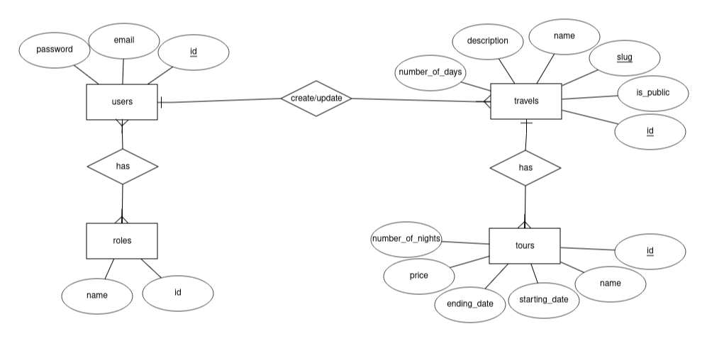

# Travel-agency-api

This is a simple Laravel API for a travel agency.

## Glossary
- Travel is the main unit of the project: it contains all the necessary information, like the number of days, the images, title, etc. An example is `Japan: road to Wonder or Norway: the land of the ICE;`.
  
- Tour is a specific dates-range of a travel with its own price and details. `Japan: Road to Wonder` may have a tour from 10 to 27 May at 1899 EGP, another one from 10 to 15 September at 669 EGP etc. In the end, you will book a tour, not a travel.

## Entity Relationship Diagram



## Installation

First clone the repo
, install the dependencies, and setup your .env file.

```
git clone git@github.com:abdelrahman-gado/travel-agency-api.git
composer install
cp .env.example .env
```

Then provide value to `ADMIN_EMAIL` and `ADMIN_PASSWORD` in the `.env`

```
ADMIN_EMAIL=admin@admin.com
ADMIN_PASSWORD=admin
```

Then create the necessary database and the `DB_DATABASE`, `DB_USERNAME` and `DB_PASSWORD` to the `.env`

Then migrate and run seeders
```
php artisan migrate
php artisan db:seed
```
